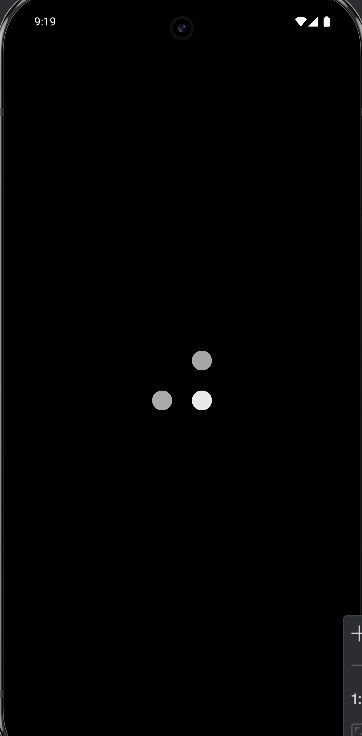
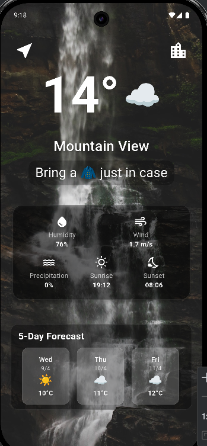
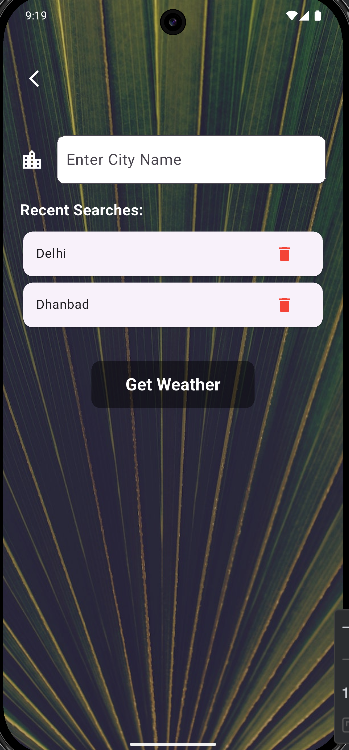

# 🌦️ Weather Dashboard  
A Flutter-based weather dashboard designed to deliver real-time weather data, a 5-day forecast, and offline-ready recent searches — powered by the **OpenWeatherMap API**.

---

## ⚡ Tech Stack

- **Flutter**
- **OpenWeatherMap API**
- **Provider** (State Management)
- **SharedPreferences** (Local Caching)

---

## 🚀 Features

- **Current Weather**: Temperature, condition, humidity, wind speed, sunrise & sunset.
- **5-Day Forecast**: Horizontally scrollable forecast with weather icons.
- **Search History**: Stores recent city searches using local storage.
- **Autocomplete Search**: City suggestions as you type.
---


## 📸 Screenshots

> Include your app screenshots here. Example format below:


### Loading Screen

### Location Screen

### City Screen



## 🛠 Setup Instructions

```bash
# 1. Clone the project
https://github.com/MohitShukla29/weather_app.git

# 2. Navigate to the project folder
cd weather_app_assignment

# 3. Get the Flutter packages
flutter pub get

# 4. Run the app
flutter run
```
## Location Permission
This app requires location access to fetch the weather data for your current location.

On first launch, the app will ask for location permission.

